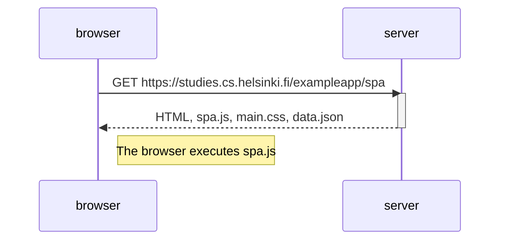

##### Create a diagram depicting the situation where the user goes to the single-page app version of the notes app at https://studies.cs.helsinki.fi/exampleapp/spa.

1. User Opens SPA: The user, represented by the browser, initiates the interaction by sending a GET request to the server to access the single-page app (SPA) version of the notes app. The server responds by sending back the HTML, spa.js, main.css, and data.json to the browser.

2. JavaScript Execution: The note to the right of the browser indicates that the browser executes the spa.js JavaScript code. This code likely contains logic to handle user interactions and update the UI without reloading the entire page.

