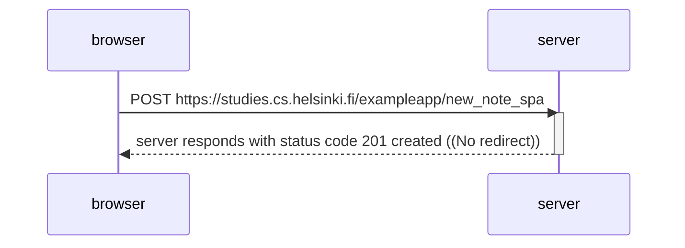

#### Create a diagram depicting the situation where the user creates a new note using the single-page version of the app.

User Adds a New Note: The user, through the SPA interface, adds a new note. This is typically done through the execution of JavaScript code (spa.js) that handles the form submission. The server responds with a status code of 201 Created, indicating that the new note was successfully created on the server side. Importantly, there is no URL redirect (no further action that would result in a page reload).

