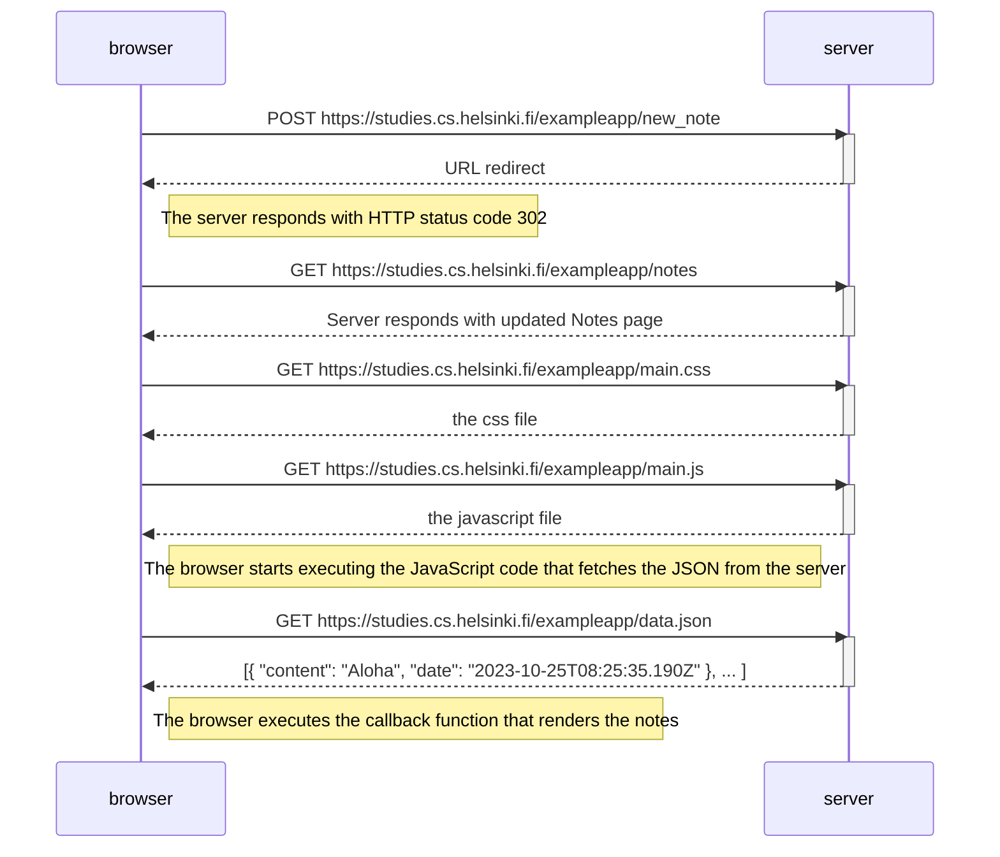

## Create a diagram depicting the situation where the user creates a new note on the page https://studies.cs.helsinki.fi/exampleapp/notes by writing something into the text field and clicking the Save button.

1. First user writes something into the text field and clicks the "Save" button.
2. Browser sends an HTTP POST request to https://studies.cs.helsinki.fi/exampleapp/new_note .
3. Server responds with an HTTP status code 302 (redirect).
4. Browser receives the redirect response and issues an HTTP GET request to the new location, https://studies.cs.helsinki.fi/exampleapp/notes
5. The server processes the POST request. Data submitted with the form is accessible in req.body on the server. The server creates a new note object.
   The new note object has two fields: content and date. The server responds to the GET request with the updated Notes page.
6. Browser sends a GET request to https://studies.cs.helsinki.fi/exampleapp/main.css and fetches the main.css from the server.
7. Browser sends a GET request to https://studies.cs.helsinki.fi/exampleapp/main.js and fetches the main.js from the server.
8. Browser sends a GET request to https://studies.cs.helsinki.fi/exampleapp/data.json and fetches the data.json from the server.

